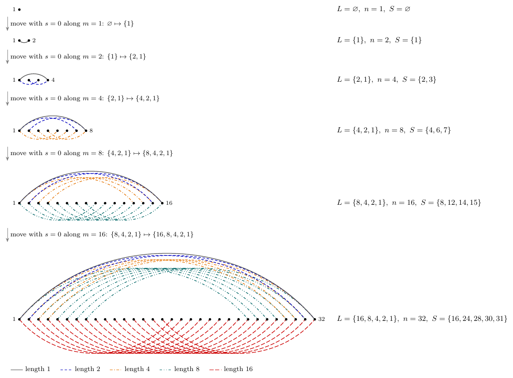
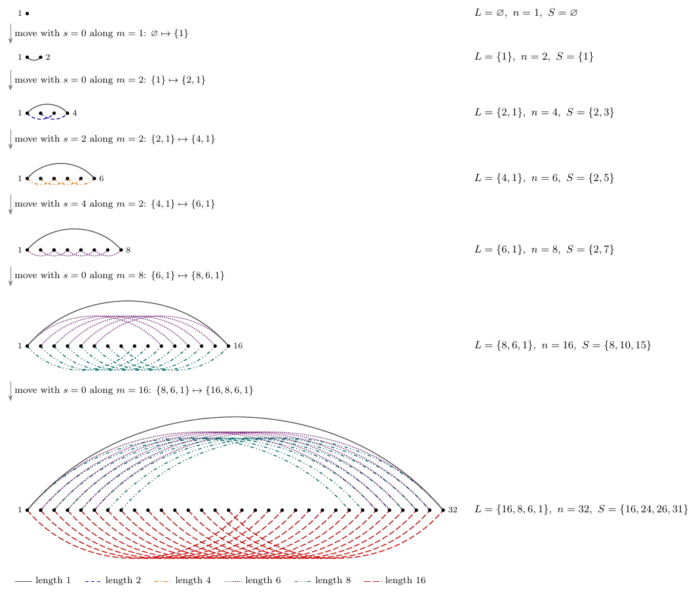
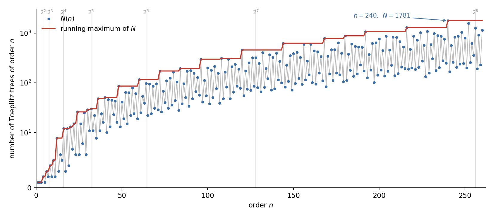

## What this post is

A companion to a manuscript of mine, *Toeplitz trees: prime jumps, growth and existence thresholds*. The paper has the proofs. This post has the objects, the four main results, and the small numbers you can check yourself in a minute, together with a downloadable atlas of examples.

The manuscript is being prepared for submission. A link will appear here once it is public.

## The objects

Fix $n \ge 1$ and a set $S \subseteq [n-1]$ of **jumps**. The **Toeplitz graph** $T_n\langle S\rangle$ has vertex set $[n] = \{1,\dots,n\}$, and distinct $i, j$ are adjacent when $\lvert i-j\rvert \in S$. These are the finite distance graphs on an interval.

Connectivity of such a graph is not a side question. A word having every element of $S$ as a period is constant on each component of $T_n\langle S\rangle$, so connectivity here is exactly the subject of the Fine and Wilf theorem and its extensions to several periods. The trees among these graphs are the extremal case.

One piece of bookkeeping makes everything else easy. Call $n-t$ the **length** of a jump $t$. The jump $t$ contributes the $n-t$ edges $\{i, i+t\}$, so

$$
T_n\langle S\rangle \text{ is a tree} \iff \text{it is connected and its lengths sum to } n-1 .
$$

Since $\{1, 1+t\}$ is an edge for every $t \in S$, distinct jump sets give distinct graphs, and a Toeplitz tree is determined by its set of lengths. So write $\operatorname{ord} L = 1 + \sum_{\ell \in L} \ell$ for a finite set $L$ of positive integers, and call $L$ a **tree length set** when the corresponding graph is a tree.

## The dictionary

The starting point is that these trees are not new objects. They are the graphs of **epicentral words** of de Luca and Zamboni.

For a word $v$, let $\psi(v)$ be its iterated palindromic closure, so $\psi(vx)$ is the shortest palindrome with prefix $\psi(v)x$. The words $\psi(v)$ are the palindromic prefixes of standard episturmian words, and $v$ is the directive word. Writing $p_x(v)$ for the least period of $\psi(v)x$,

$$
S(v) = \{\, p_x(v) : x \in \mathrm{alph}(v) \,\}, \qquad n = \lvert \psi(v)\rvert + 1
$$

always gives a Toeplitz tree, and **every** Toeplitz tree arises this way from a word $v$ that is unique up to renaming letters. Its lengths $n - p_x(v)$ form the Parikh vector of $\psi(\tilde v)$.

That dictionary is what lets a graph-theoretic question be attacked with tools from combinatorics on words, and conversely.

## Everything is generated by one move

A nonempty tree length set arises from exactly one smaller tree length set by exactly one move,

$$
L \ \longmapsto\ (L \setminus \{s\}) \cup \{\operatorname{ord} L\}, \qquad s \in L \cup \{0\} ,
$$

where $s = 0$ simply adds $\operatorname{ord} L$. In jump coordinates the same move sends $(n, S)$ to its successor $(n+m,\ \{m\} \cup \{t+m : t \in S,\ t \ne m\})$ along $m = n - s$. So the whole family is a tree of moves rooted at $\varnothing$, and every Toeplitz tree has a unique generation history.

Both sequences start from the empty set and agree for the first three steps. The first ends at $T_{32}\langle 16,24,28,30,31\rangle$ with length set $\{16,8,4,2,1\}$, the extremal binary example. The second branches away and ends at $T_{32}\langle 16,24,26,31\rangle$ with length set $\{16,8,6,1\}$. Each panel draws $T_n\langle S\rangle$ with the vertices on a line and one arc per edge, colored by length.

## 1. Lengths are superincreasing

Let $L = \{s_1 > \dots > s_k\}$ be a tree length set of order $n$. Then

$$
s_j \ \ge\ 1 + s_{j+1} + \dots + s_k \qquad \text{for every } j .
$$

Three consequences fall out. A tree with $k$ jumps has $n \ge 2^k$ vertices, with equality only for $L = \{2^{k-1},\dots,2,1\}$. At most one length is odd, and there is one exactly when $n$ is even. And $L'$ is a tree length set if and only if $\{1\} \cup 2L'$ is, with every tree length set containing $1$ of this form, so halving relates the trees containing the length $1$ to all trees.

On degrees, a Toeplitz tree with $k \ge 2$ jumps has maximum degree $k$, and for $k \ge 3$ its degree multiset already determines $k$ and all the lengths except the two largest. That last statement is what powers the next result.

## 2. Order and shape determine each other

> Distinct Toeplitz trees of the same order with at least three jumps are not isomorphic.

This is sharper than it looks. Two different jump sets always give different labelled graphs, but there is no obvious reason they could not give the same abstract tree. Above three jumps they never do. Below it they do, since the trees with at most two jumps are exactly paths, which is why the count of isomorphism classes for $n \ge 2$ comes out as

$$
\bar N(n) = N(n) - \tfrac{\varphi(n+1)}{2} + 1 ,
$$

where $N(n)$ counts Toeplitz trees of order $n$ as jump sets. The correction term is the collapse among the two-jump trees, which are the paths of central Sturmian words.

## 3. Growth

Let $A_k(x)$ count the trees with $k$ jumps of order at most $x$. Adapting an argument of Bucci, de Luca and De Luca gives $A_k(x) \ge k^{-k-1} x^{\log_2 k}$ for $x \ge 2^k$, and the new content is a matching upper bound, $A_k(x) \le x^{\log_2 k + O(k^{1-\log_2(5/2)})}$ uniformly in $x$. Together,

$$
\log \max_{n \le x} N(n) \ \sim\ \log \sum_{n \le x} N(n) \ \sim\ \frac{\log x \, \log\log x}{\log 2} ,
$$

and the same for isomorphism classes. In particular $N(n) \le n^{(1+o(1))\log_2\log n}$. For epicentral words over $d$ letters this replaces the known upper bound exponent $d$ by $\log_2 d + O(d^{1-\log_2(5/2)})$.

Why state it as $\log \max$ and $\log \sum$ rather than as an asymptotic for $N(n)$ itself? Because $N$ is violently irregular.

Both axes are powers of two, which is the natural scale here since the extremal tree with $k$ jumps has $n = 2^k$ vertices, the fixed-$k$ counts behave like $x^{\log_2 k}$, and the threshold bound is $n_k = O(k^2 4^k)$. On these axes a power law $n^{p}$ is a straight line of slope $p$, and the two grey guides are $n$ and $n^2$.

Two things are visible. First, $N$ is violently irregular, since $N(61) = 25$ sits directly beside $N(60) = 116$, and highly composite orders dominate, with $N(240) = 1781$ the largest below $256$. No smooth asymptotic for $N(n)$ is available, which is why the theorem is stated in the two averaged forms that are.

Second, the running maximum in red is not straight. It sits between the two guides with measured slope about $1.5$ across the whole range and about $2.0$ over the last octave from $128$ to $256$, so the effective exponent is still drifting upward rather than settling. That is the behaviour of an exponent like $\log_2\log n$, though at these sizes the picture only shows the drift, it does not pin the constant.

## 4. Prime jumps

Here is the part I like most, because the graph theory hands off to additive combinatorics.

Fix all lengths but one. With $P$ the fixed ones and $m = \operatorname{ord} P$, whether $P \cup \{s\}$ is a tree length set depends only on $s \bmod m$, and the condition is invariant under the reflection $s \mapsto 2\max P - s \pmod m$. Periodicity plus reflection, together with composition and doubling constructions, produce families of trees whose jumps are affine-linear forms in two parameters. Feeding those forms to the theorem of Green and Tao on linear equations in primes gives, for every $k \ge 3$,

$$
\gg_k \ \frac{x^2}{(\log x)^{k+1}}
$$

Toeplitz trees of order at most $x$ whose $k$ jumps are **all prime**.

In the language of words these are gold period vectors of epicentral words with exactly $k$ distinct letters, which answers a question of de Luca and Zamboni. The question as literally posed allows letters that do not occur, and in that form it has an easy answer from three primes $p$, $r$, $p+r-1$. The content here is the case where all $k$ letters occur, so the entries are pairwise distinct primes, with a quantitative lower bound attached.

## 5. Existence thresholds

Let $n_k$ be the least integer such that a Toeplitz tree of order $n$ with $k$ jumps exists for **every** $n \ge n_k$. The bound $n \ge 2^k$ says small orders are impossible, but it says nothing about gaps higher up, and gaps do occur.

For three jumps the orders that work below the threshold are

$$
n \in \{8, 12, 14, 15, 16, 18, 20, 21, 22, 23, 24\} ,
$$

then $25$ fails, and every $n \ge 26$ works, so $n_3 = 26$. For four jumps $67$ fails and every $n \ge 68$ works, so $n_4 = 68$. In general $2^{k+1} - 2 \le n_k = O(k^2 4^k)$.

The single missing order at $25$, sitting above eleven orders that do work, is the kind of fact that is invisible from the asymptotics and obvious from a table.

## Check it yourself

Everything numerical above comes from one short script in this folder, [`toeplitz_tree_census.py`](toeplitz_tree_census.py), which enumerates tree length sets by the move of Section 1 rather than by testing subsets. It confirms independently that

- $N(n)$ for $n = 1,\dots,12$ is $1, 1, 1, 2, 1, 3, 2, 4, 2, 5, 2, 9$, agreeing with a brute-force search over all jump sets for every $n \le 18$,
- every length set produced is superincreasing,
- the smallest tree with three jumps is $T_8\langle 4,6,7\rangle$, with length set $\{4,2,1\}$,
- the three-jump orders below the threshold are exactly the eleven listed above, $25$ is absent, and $n_3 = 26$,
- $67$ is absent for four jumps and $n_4 = 68$.

## An atlas

There are exactly **103** Toeplitz trees with at least three jumps of order $n \le 32$, that is, exactly 103 that are not paths. They are drawn, one per entry, here.

[**Atlas of the 103 non-path Toeplitz trees, $n \le 32$** (PDF)](toeplitz-trees-atlas-103.pdf)

## Related

- [[computation/Graph/cycle-successor-prime-decomposition|Cycle successors and a prime-decomposition theorem for graph automorphisms]], another arithmetic constraint on a graph-theoretic relation
