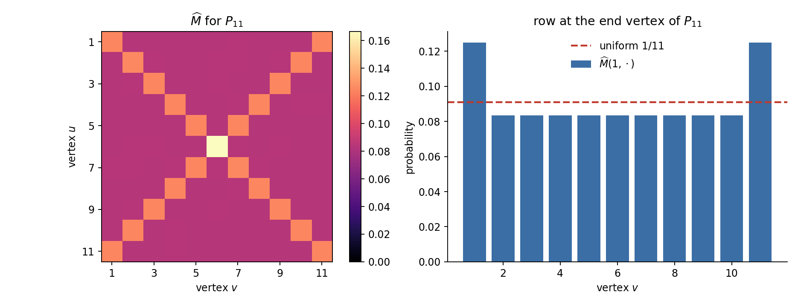
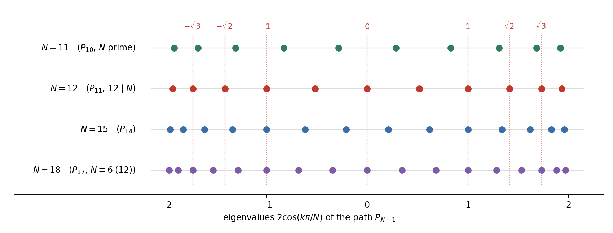

## What this post is

This started as two manuscripts answering a question about paths in opposite directions. One says a certain infinite family of paths can never mix uniformly. The other says another infinite family always can. Since then the two halves have merged into a classification, now public as a physics-framed Letter on the arXiv, and the boundary between the two sides turns out to be sharper than I expected. This post is the informal account of what the question is, why the two answers are not in conflict, and where the line actually falls.

Everything below is stated at the level I would say it out loud. The proofs, the hypotheses, and the exact constants live in the manuscripts.

## The setup

Let $X$ be a graph on $n$ vertices with adjacency matrix $A$. The continuous-time quantum walk on $X$ is the unitary

$$
U(t) = \exp(itA), \qquad t \in \mathbb{R},
$$

and the **mixing matrix** at time $t$ records where the walk has gone,

$$
M(t)_{u,v} = \lvert U(t)_{u,v} \rvert^2 .
$$

Each $M(t)$ is doubly stochastic. Averaging over all time in the Cesàro sense gives the **average mixing matrix**

$$
\widehat{M} \;=\; \lim_{T \to \infty} \frac{1}{T}\int_0^T M(t)\, dt \;=\; \sum_r E_r \circ E_r ,
$$

where $A = \sum_r \theta_r E_r$ is the spectral decomposition and $\circ$ is the entrywise product. The formula on the right is the reason average mixing is a spectral and combinatorial object rather than an analytic one.

For paths the answer is remarkably rigid. Here is $\widehat{M}$ for $P_{11}$.

Every diagonal entry equals $\tfrac18$ except at the centre vertex, where it is $\tfrac16$. The row at an end vertex takes only two values, $\tfrac18$ at the two ends and $\tfrac1{12}$ everywhere else. Uniform would be $\tfrac1{11}$, drawn as the dashed line. The plain time average is close to uniform but it is not uniform, and no amount of waiting changes that.

## The question

So the plain Cesàro average is the wrong thing to ask about. The right question, recorded by Baptista, Coutinho and Marques, allows us to choose how we average. Write

$$
\mathcal{M}(X) \;=\; \overline{\operatorname{conv}}\,\{\, M(t) : t \in \mathbb{R} \,\}
$$

for the closed convex hull of the whole orbit of mixing matrices. A point of $\mathcal{M}(X)$ is exactly what you get by averaging $M(t)$ against some probability law on time. The question is then very clean.

> Is the uniform doubly stochastic matrix $\tfrac1n J$ an element of $\mathcal{M}(X)$?

If it is, we say $X$ admits **uniform average mixing**. The Cesàro average $\widehat{M}$ is one particular point of $\mathcal{M}(X)$, namely the one coming from Lebesgue averaging, and the figure above says only that this particular point misses the target. It says nothing about the rest of the hull.

Asking the question this way turns a dynamical problem into a convex-geometry problem. Membership in a closed convex set fails only for one reason, so a negative answer must come with a separating linear functional. That is exactly the shape of the first result.

## The negative side

For the paths $P_{12m-1}$, that is for $P_{11}, P_{23}, P_{35}, \dots$, uniform average mixing does not happen. The proof produces an explicit matrix $Y$, a dual certificate, with

$$
\langle Y, M(t)\rangle \;\ge\; c \;>\; \big\langle Y, \tfrac1n J \big\rangle \qquad \text{for every } t,
$$

so the whole orbit sits strictly on one side of a hyperplane that the uniform matrix sits on the other side of. The certificate is exact, built from cyclotomic arithmetic rather than from floating point, which matters because the gap $c - \langle Y, \tfrac1n J\rangle$ is small and a numerical separation would prove nothing.

This answers the recorded question negatively for an infinite family.

## Why twelve

Index paths by $N = n+1$, so that $P_{N-1}$ has eigenvalues

$$
\theta_k = 2\cos\!\big(k\pi/N\big) = \zeta_{2N}^{\,k} + \zeta_{2N}^{-k}, \qquad k = 1, \dots, N-1 ,
$$

which live in the real cyclotomic field $\mathbb{Q}(\zeta_{2N} + \zeta_{2N}^{-1})$. What controls $\mathcal{M}(X)$ is not the eigenvalues themselves but the additive relations among their differences, because those relations are what cut the closure of the phase orbit down from the full torus to a proper subtorus. Fewer relations means a bigger achievable set.

At $N = 12$ the spectrum degenerates as far as it possibly can. It contains $0$, $\pm 1$, $\pm\sqrt2$, $\pm\sqrt3$ and the two values $(\sqrt6 \pm \sqrt2)/2$, so the whole spectrum lies in $\mathbb{Q}(\sqrt2, \sqrt3)$. Those small square roots are not decoration, they are the source of the extra relations, and the condition $12 \mid N$ is precisely the field-theoretic statement that they are all present at once. The certificate is assembled from that structure.

At $N = 11$, by contrast, the eigenvalues are a full Galois orbit of degree five with no such coincidences.

## The positive side

That contrast is the second result. For every odd prime $p$, the path $P_{p-1}$ **does** admit uniform average mixing, and it does so under a finitely supported law, that is under an average over finitely many times rather than a limit.

The argument runs the negative one backwards. Primality forces the phase orbit closure to be the full torus, a parity identity together with a Dirichlet kernel estimate places the target moment vector in the interior of the relevant moment body, and Carathéodory then converts interior membership into an explicit finite mixture. Counting the atoms gives a bound of

$$
\frac{(p-1)^2}{4} + 1
$$

times, which is finite and explicit even though it is surely not optimal.

So $P_{10}$ mixes uniformly and $P_{11}$ cannot, and the two facts are decided by the arithmetic of $11$ against the arithmetic of $12$.

The same argument then reaches further than the primes. Uniform average mixing is achievable whenever

$$
N \ \text{is a power of two, a prime, or twice a prime.}
$$

## Where the boundary actually is

The obvious guess is that primality is the point. It is not, and neither is $12$. Working out exact certificates for $N = 15$ and $N = 18$, the first cases outside both families, pushed the obstruction down to a much smaller condition. Uniform average mixing is impossible when

$$
15 \mid N, \qquad 21 \mid N, \qquad\text{or}\qquad 6 \mid N \ \text{ with } N \ge 12 .
$$

The original $12 \mid N$ family is the special case of the third condition where the field degenerates all the way to $\mathbb{Q}(\sqrt2,\sqrt3)$. The two odd conditions $15 \mid N$ and $21 \mid N$ are genuinely separate, no divisibility by six covers them, and finding them is what convinced me the obstruction was arithmetic rather than geometric.

What the obstruction really detects is a **parity collision**. Uniformity forces a specific value on each averaged cosine coherence, determined by the mirror parity of the mode, and two modes that happen to share a Bohr frequency are then asked for two incompatible values at once. Classifying when that happens is a question about vanishing sums of roots of unity, which is why the answer arrives as a list of divisibility conditions rather than as one clean criterion.

Beyond that the problem separates into three genuinely different questions, which I think is the most useful thing to take away from all of this.

1. **Affine.** Does the target lie in the affine hull of the orbit? This is linear algebra over a cyclotomic field.
2. **Closed convex.** Does it lie in the closed convex hull? This is the separation question, and it is where the certificates live.
3. **Exact realization.** Is it attained by a finitely supported law? This is Carathéodory plus a Kronecker style density argument.

The negative results kill stage two, the positive result completes all three, and there is no reason to expect the three stages to have the same answer in general.

A gap remains between the two lists. Plenty of $N$ is neither a power of two, a prime nor twice a prime, and is divisible by none of $15$, $21$, or by $6$ with $N \ge 12$, and those leftover cases are open. What is left there looks to me like pure number theory about vanishing sums of roots of unity, and it deserves someone who does that properly rather than someone who wants it as a lemma. The structural side, the obstruction space $W_N$, its Galois module structure, and the duality that produces the certificates, is what I am keeping.

## Status and code

The classification is public as a Letter, **[arXiv:2609.14463](https://arxiv.org/abs/2609.14463)**, *Arithmetic of Bohr Frequencies Governs Uniform Mixing in Randomly Timed Quantum Spin Chains*. It states the results in physical terms, a uniformly coupled XY chain read out at a random time, where the paths above are the chains and uniform average mixing is uniformity of the site populations. The obstruction for the first case sits separately at **[arXiv:2607.25490](https://arxiv.org/abs/2607.25490)**, *An Exact Obstruction to Uniform Average Mixing on $P_{11}$*.

A mathematics-facing version of the merged classification is under review.

The figures on this page were produced by the two scripts in this folder, [`avg_mixing_figures.py`](avg_mixing_figures.py) and [`spectra_figure.py`](spectra_figure.py). They compute $\widehat{M}$ straight from the spectral idempotents, so anyone can check the numbers quoted above in a few seconds.

## Related

- [[quantum/preprint-preview/preprint-index|Counting trees with a quantum walk]], on average mixing on line graphs
- [[quantum/glued-clique-sedentariness/index|Sedentariness on glued-clique graphs]], a manuscript currently under review
