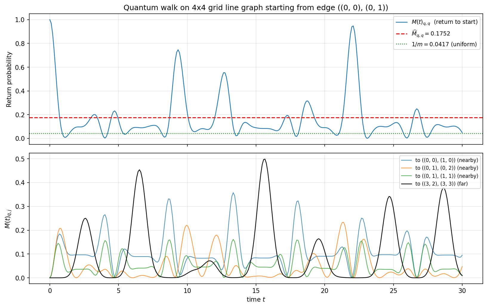
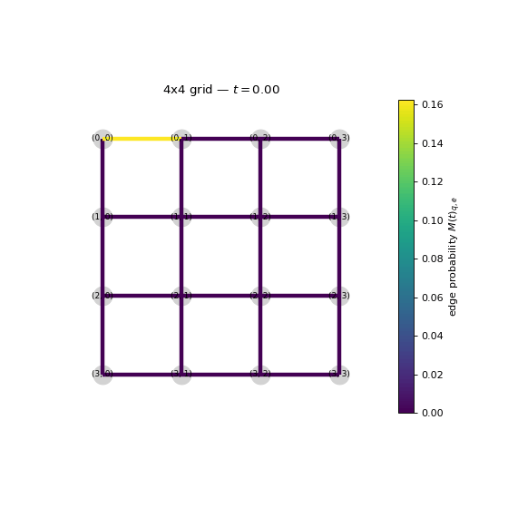
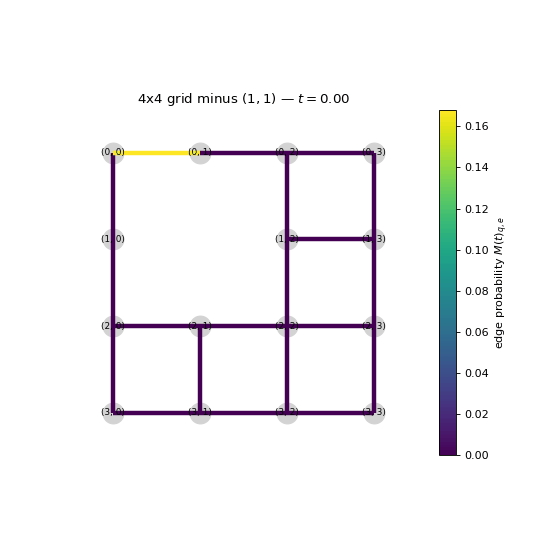
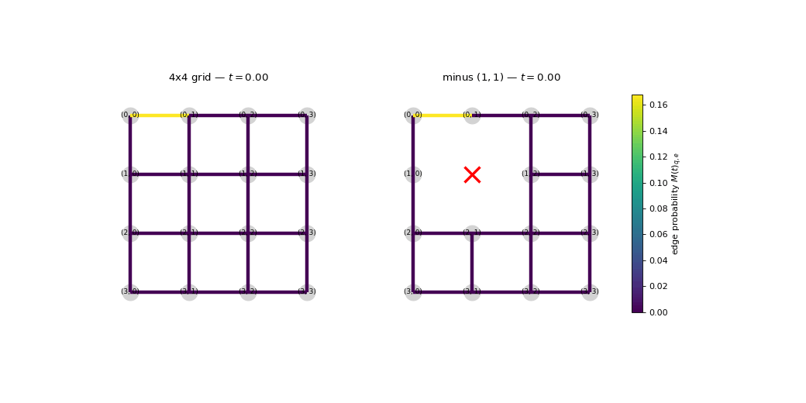
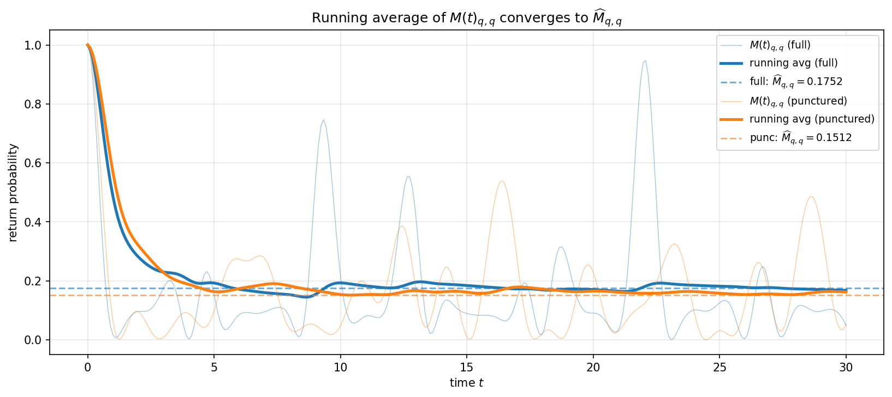

## What this post is for

In an [[quantum/ctqw-line-tensor|earlier post]] I looked at the **time-averaged mixing matrix** $\widehat{M}_\infty$ on line graphs of tensor products. That object is exactly what you want for combinatorial questions — it is what shows up in spanning-tree counting, in periodicity questions, in essentially everything where you only care about the long-run statistics. But it is a *Cesàro mean*, not a pointwise limit, and the limit it averages over **never settles.** A unitary walk is reversible: the wavefunction keeps oscillating, forever.

This post is the visualization companion. Same setup — continuous-time quantum walk on the line graph of a small grid — but now we plot

$$
M(t) = U(t) \circ \overline{U(t)} \quad (\text{entrywise}), \qquad U(t) = e^{itA},
$$

as a function of $t$, and watch what the walk actually does. Three GIFs and two static plots, all generated by the notebook linked at the bottom.

The graph this time is $\Gamma = P_4 \,\square\, P_4$ — a $4\times 4$ grid (Cartesian product of two paths). And we compare against a **punctured** variant: the same grid with the interior vertex $(1,1)$ removed. Watching the wave route around a hole is genuinely fun.

## Quick recap

Let $\Gamma$ be a finite simple graph with adjacency $A_\Gamma$. Its **line graph** $L(\Gamma) = \ell(\Gamma)$ has the edges of $\Gamma$ as its vertices, with $e \sim f$ iff $e$ and $f$ share an endpoint in $\Gamma$. The continuous-time quantum walk on $L(\Gamma)$ is

$$
|\psi(t)\rangle = e^{i t A_{L(\Gamma)}}|\psi_0\rangle,
$$

with Hamiltonian $H = A_{L(\Gamma)}$ and $\hbar = 1$. We start at a single edge: $|\psi_0\rangle = |q\rangle$ for a chosen edge $q$ of $\Gamma$. The instantaneous mixing matrix is

$$
M(t)_{e,f} = |\langle e | U(t) | f\rangle|^2,
$$

and its long-time average is the familiar

$$
\widehat{M}_\infty(e, f) = \lim_{T \to \infty} \tfrac{1}{T}\int_0^T M(t)_{e,f}\, dt = \sum_{\lambda \in \mathrm{spec}(A_{L(\Gamma)})} \langle e | E_\lambda | f \rangle^2.
$$

Pictures below are all of $M(t)_{q, e}$ as $e$ ranges over edges of $\Gamma$, drawn as edge weights on $\Gamma$ itself.

## 1. Return probability — oscillation, not convergence

Start at the corner edge $q = ((0,0), (0,1))$ on the $4\times 4$ grid line graph. Plot $M(t)_{q,q}$, the probability of finding the walker back at the starting edge, as a function of $t$:

The dashed red line is $\widehat{M}_\infty(q, q) \approx 0.175$. The dotted green line is the uniform value $1/m$ where $m = 24$ is the number of edges of the grid.

What you should notice:

- $M(t)_{q,q}$ **does not converge.** It bounces between near-1 and near-0 with no settling. This is automatic — $M(t)_{q,q}$ is a finite sum of cosines $\sum_{\lambda, \mu} c_{\lambda \mu} \cos((\lambda - \mu) t)$, and almost-periodic functions of this kind never converge unless they are constant.
- The time average $\widehat{M}_\infty(q,q)$ sits *above* uniform: a corner edge "remembers" itself more than its share. This is the quantum-walk analogue of the antipodal-peak phenomenon I saw in the previous post.
- The bottom panel shows three nearby edges (in color) and one far edge (black, $((3,2), (3,3))$, diagonally opposite). The far edge takes time to "hear" the wave at all — its first big peak is around $t \approx 6$. That delay is the wave-front speed. The three nearby edges respond immediately and oscillate at higher amplitudes than far ones — this is the closest a unitary system gets to having a notion of "diffusion."

## 2. The walk on the grid

Now draw $M(t)_{q, \cdot}$ as edge weights on the grid itself, animated:

You can read off three things by eye:

**Initial spreading is wave-like, not diffusive.** A classical random walk would simply diffuse — high probability decreasing smoothly outward. The quantum walk has a clear *front*: a band of high probability propagates from $q$, reflects off the boundary, and interferes with itself.

**Boundary reflections are coherent.** When the wavefront reaches a boundary, it doesn't just absorb or thermalize — it bounces back, and the reflected wave interferes with newly outgoing waves to produce the lattice-like patterns you see at intermediate times.

**There is no convergence frame.** Watch the GIF run all the way through. At no point does the picture stop changing. You will see *recurrences* — moments where almost all the probability has piled up near $q$ again — and these correspond to the tall peaks in the time-series above.

## 3. The punctured grid

Remove the interior vertex $(1,1)$ and run the same simulation. Now there is a *hole* in the middle of the grid:

Two phenomena worth pausing on:

**Diffraction.** The wavefront has to route around the hole. When two parts of the wave that have gone around opposite sides of the hole meet again on the other side, they interfere — sometimes constructively (bright spots), sometimes destructively (persistent dark edges). This is just slit-experiment physics, played out on a finite graph.

**Localization.** Some edges near the hole acquire higher long-run averages than they "should" — a vertex defect creates eigenmodes that concentrate near the defect. Time-averaging amplifies these because the localized modes contribute a larger near-constant term to $\widehat{M}_\infty$.

## 4. Side-by-side comparison

The cleanest way to see the difference is to put the two next to each other, sharing a color scale and a clock:

For the first second or so, the two are nearly identical — the wave hasn't reached the hole yet. After that, they diverge sharply. The punctured-grid panel acquires a clear band of brighter edges along the path the wave was *forced* to take around the missing vertex. Late in the GIF, the punctured walk looks visibly less uniform — defect-localized modes dominate.

## 5. Cesàro mean: where $\widehat{M}_\infty$ is hiding

So if $M(t)$ never settles, what does the time average actually do? It cancels the oscillations. Plot the running average $\frac{1}{T}\int_0^T M(t)_{q,q}\, dt$ alongside $M(t)_{q,q}$ itself:

The thick lines are running averages; the thin lines underneath are the raw $M(t)_{q,q}$. The dashed lines mark the exact $\widehat{M}_\infty(q,q)$ values for each graph. You can watch the running averages settle onto the dashed lines while the raw values keep bouncing.

This is the picture I keep meaning to explain: $\widehat{M}_\infty$ is a perfectly meaningful object — it answers questions about long-run statistics, and it has a clean spectral formula — *but it is not a pointwise limit of anything*. The thing it averages keeps moving.

For the punctured grid, the average sits *lower* than the full grid's average. The wave can no longer be at the corner edge in quite as many configurations — some of the eigenmodes that contributed to $\widehat{M}_\infty$ on the full grid simply don't exist when you remove a vertex.

## What to take away

Three things, in order of how surprising they were to me when I first ran this:

1. **The instantaneous picture and the averaged picture look completely different.** $M(t)$ is sparse and wave-like; $\widehat{M}_\infty$ is smoothly spread. Anything you want to say about *dynamics* lives in the first; anything you want to say about *invariants* lives in the second.
2. **A graph defect is a genuine scattering center.** The quantum walk does not just "go slower" through a punctured region — it diffracts and localizes, and the long-run average reflects both effects.
3. **The Cesàro mean is doing real work.** It is not just notation. The running-average plot shows you, visually, what averaging is for: it is the only thing that *converges*.

## Where this is going

Two natural next steps for the blog:

- **Spectral source of the localization.** The eigenvectors of $A_{L(\Gamma_{\text{punc}})}$ that concentrate near the missing vertex have specific support, and the size of $\widehat{M}_\infty(q, q) - \widehat{M}_{\text{full}}(q, q)$ should be readable from those eigenvectors directly.
- **Connection to the Schur-state framework.** The instantaneous Schur state $S^e(t)$ for a pure edge state encodes all of $M(t)_{e,\cdot}$, and $A(e) = \overline{S^e} \circ S^e$ is precisely the column of $M(t)$ that we have been animating, reshaped onto $\Gamma$. Time-averaging gives $\widehat{A(e)}_{v,w} = \widehat{M}_\infty(e_{vw}, e)$, which is the column of $\widehat{M}_\infty$ as edge weights on $\Gamma$. This is the framework in which the random-weight result $tn(\Gamma, 1/m) = m^{-(n-1)}\, tn(\Gamma)$ that I'll present at the upcoming Hyunsong talk lives.

## Code and reproducibility

The notebook that produced everything above — `continuous_walk_revised.ipynb` — is included with this post. It uses only `numpy`, `networkx`, and `matplotlib`, and every figure rebuilds in under a minute on a laptop. The four functions worth knowing are:

- `line_graph_adjacency(G)` — builds $A_{L(\Gamma)}$ via the line-graph construction in `networkx`,
- `time_evolved_M(A, t_array)` — vectorized $M(t)$ via the spectral decomposition of $A$,
- `average_mixing_matrix(A)` — the closed-form $\widehat{M}_\infty$ via spectral projectors (no integration),
- a small `LineCollection`-based animation function that draws edge weights cleanly.

To produce the GIFs yourself, set `save_gifs = True` in the last cell.

## References

1. C. Godsil, *Average mixing of continuous quantum walks*, J. Combin. Theory Ser. A 120 (2013).
2. C. Godsil and H. Zhan, *Discrete-time quantum walks and graph structures*, J. Combin. Theory Ser. A 167 (2019).
3. R. Portugal, *Quantum Walks and Search Algorithms*, Springer, Ch. 7.
4. A. Childs, *On the relationship between continuous- and discrete-time quantum walk*, Comm. Math. Phys. 294 (2010).
