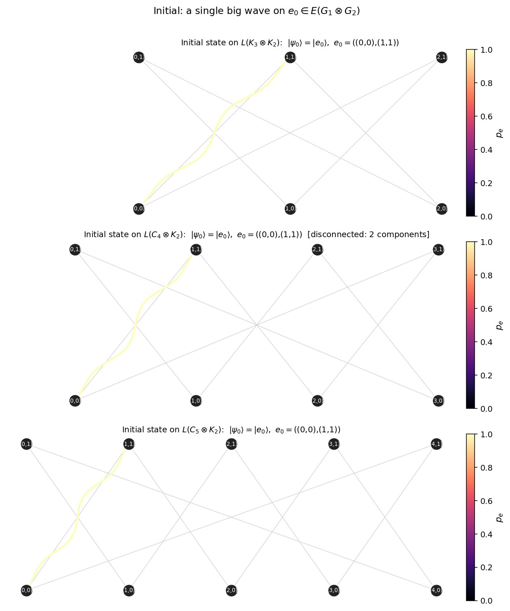
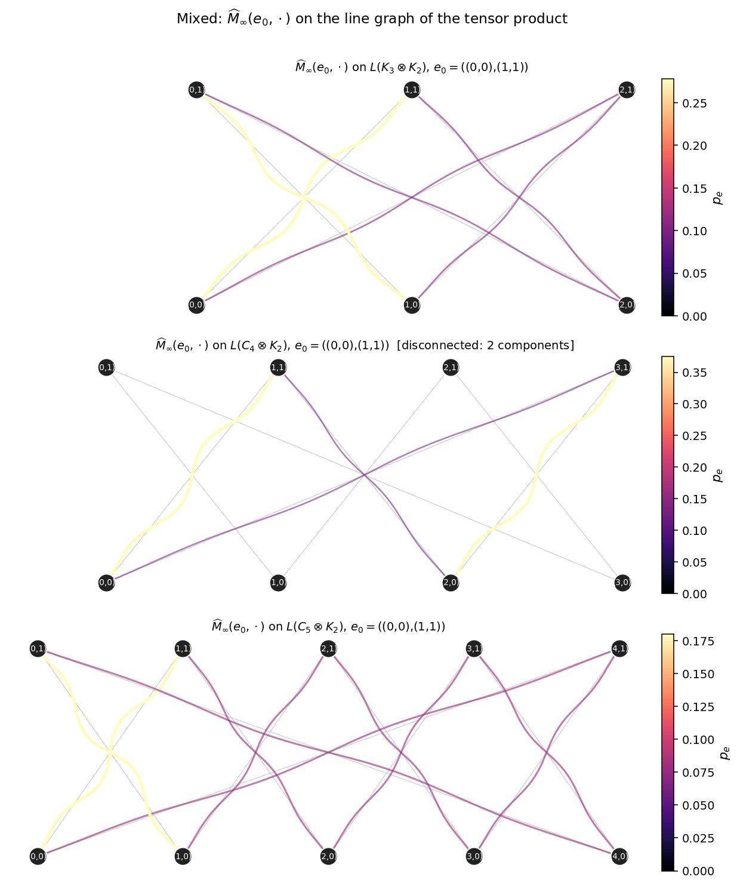
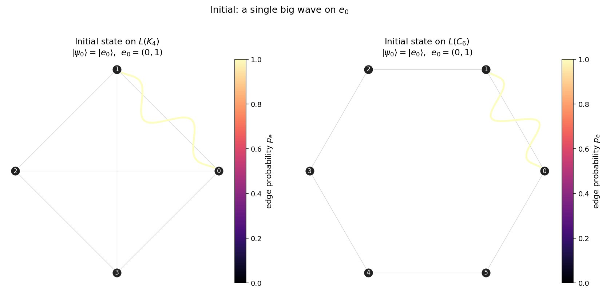
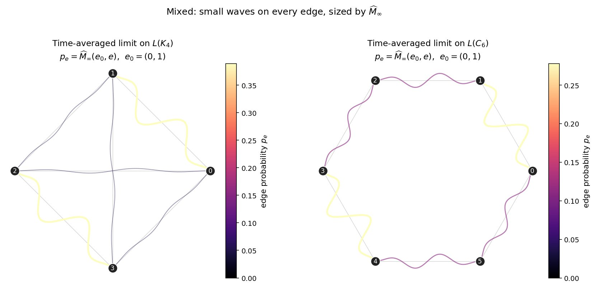

## Overview

This is the first entry of a running journal on quantum walks and combinatorics on graphs. The aim is modest: pick a small experimental question, run it carefully, and let the pictures do the arguing before we move on to proofs.

Today's question. Take two finite simple graphs $G_1, G_2$ and form their **tensor (categorical) product** $G_1 \otimes G_2$, whose adjacency matrix is the Kronecker product $A_1 \otimes A_2$. Then form the **line graph** $L(G_1 \otimes G_2)$. Run a continuous-time quantum walk on this line graph and ask what the time-averaged occupation distribution looks like.

There is a known but easily-forgotten obstruction lurking here — Weichsel's theorem — and we will see it directly in the figures.

## Setup

The continuous-time quantum walk (CTQW) on a graph with adjacency matrix $A$ is the unitary evolution

$$
U(t) = e^{i t A}, \qquad |\psi(t)\rangle = U(t) |\psi_0\rangle,
$$

with $\hbar = 1$ and Hamiltonian $H = A$. A pure state $|\psi(t)\rangle$ produces probabilities $p_v(t) = |\langle v | \psi(t) \rangle|^2$ on each vertex.

Since $|\psi(t)\rangle$ does not converge as $t \to \infty$, the natural object is the **time-averaged mixing matrix**

$$
\widehat{M}_T(u, v) = \frac{1}{T} \int_0^T |\langle v \,|\, e^{i t A} \,|\, u \rangle|^2 \, dt,
$$

with limit

$$
\widehat{M}_\infty(u, v) = \lim_{T \to \infty} \widehat{M}_T(u, v) = \sum_{\lambda \in \mathrm{spec}(A)} \langle v | E_\lambda | u \rangle^2,
$$

where $E_\lambda$ is the spectral projector onto the $\lambda$-eigenspace of $A$. The closed-form on the right is what we'll actually compute, since it lets us avoid numerical integration entirely.

## Three constructions in one line

For the experiment we need three operations:

1. **Tensor product** of graphs $G_1 \otimes G_2$, with $A_{G_1 \otimes G_2} = A_1 \otimes A_2$.
2. **Line graph** $L(G)$, whose vertices are the edges of $G$ and whose adjacency satisfies $A_{L(G)} = B^\top B - 2I$ where $B$ is the unsigned incidence matrix of $G$.
3. **CTQW** on $L(G_1 \otimes G_2)$, started in $|\psi_0\rangle = |e_0\rangle$ for a chosen edge $e_0 \in E(G_1 \otimes G_2)$.

All three fit in a few lines of `numpy` / `scipy`:

```python
import numpy as np
from scipy.linalg import expm

def kronecker_product(A1, A2):
    return np.kron(A1, A2)

def incidence_matrix(A):
    n = A.shape[0]
    edges = [(i, j) for i in range(n) for j in range(i+1, n) if A[i, j]]
    B = np.zeros((n, len(edges)))
    for k, (i, j) in enumerate(edges):
        B[i, k] = B[j, k] = 1
    return B, edges

def line_graph_adjacency(A):
    B, edges = incidence_matrix(A)
    L = B.T @ B - 2 * np.eye(len(edges))
    return L, edges

def average_mixing_matrix_exact(A, tol=1e-9):
    w, V = np.linalg.eigh(A)
    # Group eigenvectors by eigenvalue, project, square
    n = A.shape[0]
    M = np.zeros((n, n))
    i = 0
    while i < n:
        j = i + 1
        while j < n and abs(w[j] - w[i]) < tol:
            j += 1
        E = V[:, i:j] @ V[:, i:j].T
        M += E ** 2
        i = j
    return M
```

The identity $A_{L(G)} = B^\top B - 2I$ is the cleanest piece of bookkeeping in graph theory: incidence on the right gives line graph plus a degree-2 shift. Worth memorizing.

## The experiment

We pick three "first" graphs $G_1$ and pair each with $G_2 = K_2$:

- $G_1 = K_3$ (triangle): both factors non-bipartite-or-not — $K_3$ is non-bipartite, $K_2$ is bipartite. Weichsel says $K_3 \otimes K_2$ is connected.
- $G_1 = C_4$ (4-cycle): both factors bipartite. Weichsel says $C_4 \otimes K_2$ has **two components**.
- $G_1 = C_5$ (5-cycle): $C_5$ non-bipartite, $K_2$ bipartite. Connected again.

In each case we form $L(G_1 \otimes K_2)$, start the walk at an edge $e_0 = ((0,0),(1,1))$ in the tensor product, and look at two snapshots:

- the initial distribution $p_e(0) = \delta_{e, e_0}$ — a single big wave on $e_0$,
- the long-time average $\widehat{M}_\infty(e_0, \cdot)$ — small waves on every edge in the same component.

### Initial state



The bright wave sits exactly on $e_0 = ((0,0), (1,1))$ in each panel. Nothing has spread yet.

### Time-averaged limit



Now look at the middle panel. The walk on $L(C_4 \otimes K_2)$ visibly fails to spread to half of the line graph — you can read off the two components of $C_4 \otimes K_2$ as two disjoint constellations of "lit" edges, with the other half dark. The top and bottom panels (with at least one non-bipartite factor) light up everywhere in their connected component.

This is Weichsel's theorem made visual:

> **Weichsel (1962).** $G_1 \otimes G_2$ is connected $\iff$ both $G_i$ are connected and at least one is non-bipartite. If both are bipartite, the product splits into exactly two components.

Connected components of $G$ are invariant subspaces of $A_{G}$, hence of $e^{itA_G}$, hence of $\widehat{M}_\infty$. A walker started in one component cannot leak into the other, ever. The middle panel is showing us a hard zero, not just a small number.

## A second look — without the tensor product

To make sure the "antipodal" pattern visible above is not an artifact of the tensor product itself, here is the same diagnostic on two un-producted graphs.

### Initial state on $L(K_4)$ and $L(C_6)$



### Time-averaged limit on $L(K_4)$ and $L(C_6)$



For $G = C_6$, the line graph is again $C_6$ (a 6-cycle), and one can compute exactly

$$
\widehat{M}_\infty(e_0, \cdot) = \left( \tfrac{5}{18}, \tfrac{1}{9}, \tfrac{1}{9}, \tfrac{1}{9}, \tfrac{5}{18}, \tfrac{1}{9} \right).
$$

The two large entries sit on $e_0$ and on its **antipodal** edge in $C_6$ — a quantum signature absent from the classical random walk, where the time-averaged distribution is uniform $\frac{1}{6}$.

For $G = K_4$, the line graph is the octahedron $K_{2,2,2}$, and $\widehat{M}_\infty(e_0, \cdot)$ again concentrates on $e_0$ and on the unique edge of $K_4$ disjoint from $e_0$ — the antipodal pair in the octahedron.

Whatever **antipodal** is doing here, it is doing it for spectral reasons that should be readable from the eigenstructure of the line graph. That is the next post.

## Where this is going

A few directions worth their own posts:

- **Spectral source of the antipodal peaks.** The octahedron $K_{2,2,2}$ has spectrum $\{3, 0^{(3)}, -2^{(2)}\}$ with very specific eigenprojectors; the exact expression for $\widehat{M}_\infty(e_0, e_0) + \widehat{M}_\infty(e_0, e_0^*)$ should fall out of a small computation.
- **Perfect / pretty-good state transfer on $L(G_1 \otimes G_2)$.** Are there pairs $(e, f)$ of edges in the tensor product for which $|U(t)_{ef}| = 1$ at some $t$? Cycles and Cartesian powers of $K_2$ are the classical playground; tensor products are less explored.
- **A categorical view.** The line-graph construction is a functor on a suitable category of graphs, and $G \mapsto e^{itA_G}$ is morally a *functorial* construction once one fixes the category of finite-dimensional Hilbert spaces and unitaries. The tensor product gives this functor a natural monoidal structure, and the failure of full functoriality on disconnected products is what Weichsel's theorem is detecting. I want to spell this out properly in a later post — there is an honest categorical statement hiding behind the picture.

## Code and reproducibility

The full notebook used to produce these figures lives in this blog's [[notes/notebooks/quantum-walks-notebook|notebooks folder]] (Colab-compatible). The four key functions are short; everything else is plotting.

If you reproduce these and find that one of the antipodal entries computes to something tidier than $\frac{5}{18}$ for the $C_6$ case — or you want to add a graph to the audience-figure script — let me know.

## References

1. P. M. Weichsel, *The Kronecker product of graphs*, Proc. AMS 13 (1962), 47–52.
2. C. Godsil, *State transfer on graphs*, Discrete Math. 312 (2012), 129–147.
3. C. Godsil and J. Smith, *Strongly Cospectral Vertices*, Australasian J. Combin. 67 (2017).
4. R. Portugal, *Quantum Walks and Search Algorithms*, Springer (2018), Ch. 7 (continuous-time walks).
