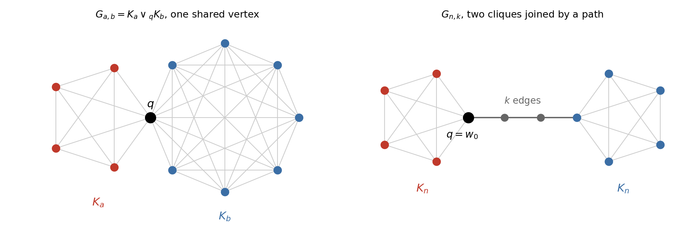
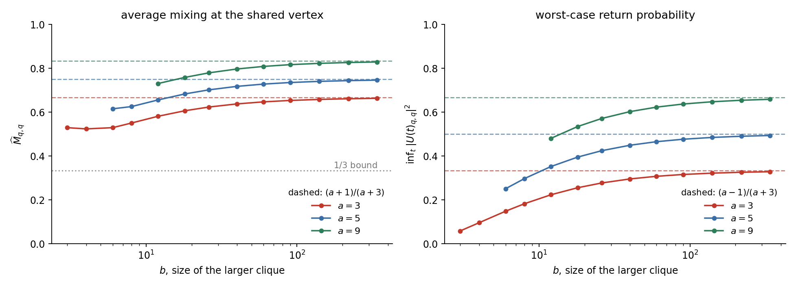
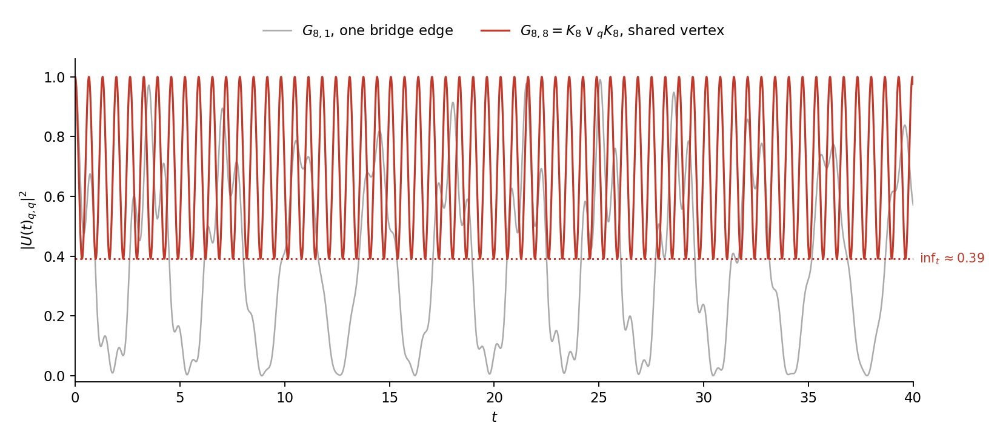

## What this post is

This is a companion to a manuscript of mine currently under review, *Continuous-time quantum walks and sedentariness on glued-clique graphs*. The paper has the proofs and the corner cases. This post has the picture I actually carry around in my head when I work on it, together with the numbers, which are all easy to reproduce.

## Staying put is the interesting behaviour

Most of the quantum walk literature asks how well a walk moves. Perfect state transfer, pretty good state transfer, uniform mixing, all of these are questions about a walk succeeding at going somewhere. **Sedentariness** is the opposite question.

Fix a vertex $q$ and let $U(t)=\exp(itA)$. Following Godsil, call $q$ **sedentary** if there is a constant $C$ with

$$
\lvert U(t)_{q,q}\rvert^2 \;>\; 1 - \frac{C}{\lvert V\rvert} \qquad \text{for all } t .
$$

The walker started at $q$ never manages to leave, and the amount it can lose shrinks as the graph grows. Monterde's weaker notion of $C$-sedentariness asks only for $\lvert U(t)_{q,q}\rvert^2 > C$ uniformly in $t$. The manuscript works with the first of the two.

The companion quantity is the average mixing matrix. Writing $A=\sum_r \theta_r E_r$ for the spectral decomposition into distinct eigenvalues,

$$
\widehat M \;=\; \lim_{T\to\infty}\frac{1}{T}\int_0^T M(t)\,dt \;=\; \sum_r E_r \circ E_r ,
\qquad
\widehat M_{q,q} = \sum_r (E_r)_{q,q}^2 ,
$$

with $\sum_r (E_r)_{q,q}=1$. So $\widehat M_{q,q}$ is the sum of squares of a probability vector, and it is large exactly when the walk at $q$ is carried by few eigenvalues. Coutinho, Godsil, Guo and Zhan asked how these diagonal entries reflect graph-theoretic invariants, and glued cliques turn out to be a family where the question can be answered exactly.

## Two ways to glue

The **one-point union** $G_{a,b}=K_a \vee_q K_b$ takes two cliques sharing a single vertex $q$, so $\lvert V\rvert = a+b-1$. The **path gluing** $G_{n,k}$ takes two copies of $K_n$ and joins a vertex of one to a vertex of the other by a path with $k$ edges, and the vertex of interest is the attachment vertex $q=w_0$.

These look like the same construction with a parameter, and the headline of the paper is that they are not. Sharing a vertex keeps the walker in place. Inserting even one bridge edge does not.

## The shared vertex, computed exactly

The partition of $V(G_{a,b})$ into the two clique cells and the singleton $\{q\}$ is equitable, with quotient matrix

$$
Q=\begin{pmatrix} \alpha-1 & 1 & 0 \\ \alpha & 0 & \beta \\ 0 & 1 & \beta-1 \end{pmatrix},
\qquad \alpha = a-1,\ \beta = b-1 .
$$

The spectrum of $A$ is the three roots of a cubic together with $-1$ repeated $(\alpha-1)+(\beta-1)$ times, and the point that makes everything computable is that $e_q$ is orthogonal to the $(-1)$-eigenspace. Only three eigenvalues carry any weight at $q$, whatever the sizes of the cliques, so $\widehat M_{q,q}$ is a sum of three squares of numbers summing to one. That alone gives the unconditional bound

$$
\widehat M_{q,q} \;\ge\; \frac13 .
$$

In the symmetric case the cubic factors nicely and

$$
\widehat M_{q,q} \;=\; \frac{n^2}{n^2+4n-4} \;\longrightarrow\; 1 ,
$$

which is the exact statement behind the intuition that two big cliques sharing a vertex trap the walker there.

## The smaller clique is in charge

Now make the two sides different. Fix $a$ and let $b\to\infty$. An implicit function theorem analysis of the cubic's roots gives

$$
\widehat M_{q,q} \longrightarrow \frac{a+1}{a+3},
\qquad
\inf_{t\ge 0}\lvert U(t)_{q,q}\rvert^2 \longrightarrow \frac{a-1}{a+3} = 1-\frac{4}{a+3},
$$

with error $O_a(b^{-1})$.

Both limits depend on $a$ only. Growing the far clique without bound does nothing once $a$ is fixed, and the sedentary limit $\widehat M_{q,q}\to 1$ needs $a\to\infty$ as well. **The sedentariness of the shared vertex is governed entirely by the smaller clique.** I find this the most quotable statement in the paper, and it is visible in the picture, the three curves flatten onto three different dashed lines rather than onto a common one.

## One bridge changes everything

Replace the shared vertex by a path of $k$ bridges. Already at $k=1$, a single edge joining the two cliques, the quotient matrix splits into symmetric and antisymmetric parts and

$$
\widehat M_{q,q}\longrightarrow \tfrac12,
\qquad
\inf_t \lvert U(t)_{q,q}\rvert^2 \longrightarrow 0 .
$$

Half of the time-averaged return probability survives, and the guarantee at every individual time is gone.

The red curve is $K_8 \vee_q K_8$ and never drops below about $0.39$. The grey curve is $G_{8,1}$, the same two cliques with one bridge edge instead of a shared vertex, and it comes essentially to zero. Two graphs of almost the same size and almost the same local structure, and one of them lets the walker escape completely.

For longer bridges the decay is inverse in the path length,

$$
\widehat M_{q,q}\longrightarrow M_\infty(k)=\frac{3}{2(k+1)}+O\!\big((k+1)^{-2}\big)
\qquad (n\to\infty),
$$

so $k\,M_\infty(k)\to \tfrac32$, which recovers Godsil's path constant exactly.

## One mechanism underneath

All of this is one lemma. Glue large $n$-cliques onto a host graph $H$ at a set $S$ of attachment vertices. Then the isospectral reduction, in the sense of Kempton and Tolbert, converges to the constant **effective operator**

$$
A_{\mathrm{eff}}(H) \;:=\; A(H)-\sum_{q\in S} e_q e_q^{\mathsf T},
$$

the host adjacency carrying a $-1$ self-energy at each glued vertex, and the resulting walk is indistinguishable from the original one with error $O(n^{-1})$.

The two families above are instances. The asymmetric union is $H=K_a$, and the path gluing is $H=P_{k+1}$ with $S$ the two endpoints, giving $L(k)=A(P_{k+1})-e_0e_0^{\mathsf T}-e_ke_k^{\mathsf T}$. A physicist would recognise the bookkeeping, a heavy bath coupled to a light system leaves behind a shifted effective Hamiltonian, and I find the agreement reassuring rather than coincidental.

## Where the limits stop commuting

The last section is the one that surprised me. Take a chain of three cliques. In the effective operator the two bridges **decouple** completely. Their average mixing at the junction does not.

The large-clique limit $n\to\infty$ and the infinite-time average $T\to\infty$ defining $\widehat M$ do not commute, and the defect $\Delta_{k,j}$ between them is strictly positive. It has a closed form, a sum over the eigenvalues shared by the two bridge operators. I call this a **graph resonance**, because each shared level splits at order $n^{-1}$ into a pair whose eigenvectors mix the two blocks that the limiting operator had separated. The splitting vanishes in the limit but the mixing it produces does not, and that residue is the defect.

The shared level $-1$ is exceptional. Its degeneracy never splits and it contributes nothing to the defect. When the two bridges have equal length the limit collapses to

$$
\tfrac12\big(M_\infty(k)+w_{-1}^2\big).
$$

This is the part of the manuscript I would most like a reader to attack.

## Status and code

The manuscript is under review and is not on the arXiv yet. A link will appear here once it is public.

Every number quoted above was checked numerically by [`glued_clique_figures.py`](glued_clique_figures.py) in this folder, which builds both families directly and reads the weights off the spectral decomposition. The symmetric formula $n^2/(n^2+4n-4)$ agrees to machine precision, the two asymmetric limits are visible in the figure, and $\inf_t\lvert U(t)_{q,q}\rvert^2$ for $G_{8,1}$ comes out at $2\times 10^{-7}$.

## Related

- [[quantum/preprint-preview/preprint-index|Counting trees with a quantum walk]], on average mixing on line graphs
- [[quantum/average-mixing-paths/index|Uniform average mixing on paths]], the other manuscript currently under review
