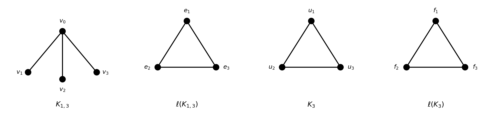
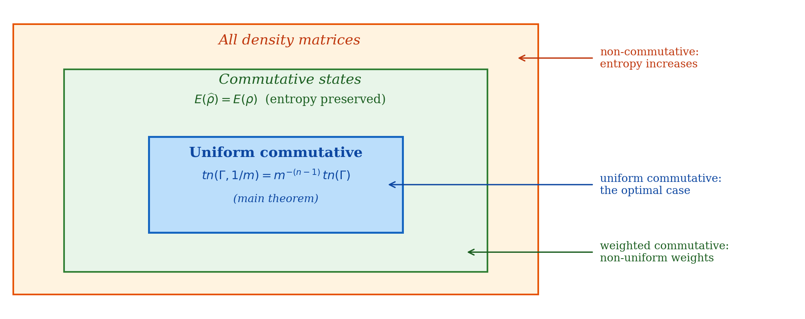
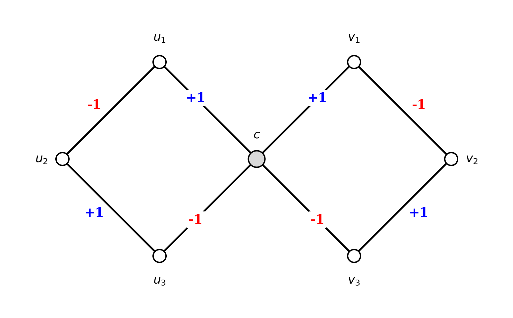

## What this post is

This is an informal companion to my upcoming preprint, *Schur States, Average Mixing, and Counting Trees on Line Graphs' CTQW.* The actual paper has all the proofs, hypotheses, and corner cases you would expect from a journal submission. This post is the version I would tell a friend over coffee — what the question is, what the answer looks like, and why the answer is not obvious.

I'm presenting this work at the [[index|Hyunsong Foundation Scholar Presentation]] on **May 7, 2026**. If you are coming to that talk, this post is the warm-up. If you are reading this later, the preprint is on its way to the [arXiv](https://arxiv.org/) and a link will appear here once it lands.

## The question in one sentence

> Take a quantum walk that lives on the *edges* of a graph $\Gamma$. Average it over all time. The resulting blob of probabilities is a weighted version of $\Gamma$ itself. **How many spanning trees does that weighted graph have?**

That is the entire question. The answer turns out to depend on the *kind* of edge state you start the walk in, and one specific kind — which I call a **uniform commutative state** — gives an unreasonably clean answer:

$$
tn\!\left(\Gamma, \tfrac{1}{m}\right) \,=\, \frac{1}{m^{n-1}}\, tn(\Gamma),
$$

where $n = |V\Gamma|$ and $m = |E\Gamma|$. Every other kind of starting state gives strictly less.

## Three things you need

### Edge states and the line graph

Most of the literature on quantum walks puts the walker at vertices. The walk I care about puts it at *edges*. Concretely: the **line graph** $\ell\Gamma$ has the edges of $\Gamma$ as its vertices, and two of these vertices are joined whenever the corresponding edges of $\Gamma$ share a vertex. A continuous-time quantum walk on $\ell\Gamma$ is then

$$
U(t) \,=\, e^{i t\, A(\ell\Gamma)}, \qquad |\psi(t)\rangle \,=\, U(t)\, |\psi_0\rangle,
$$

with the initial state $|\psi_0\rangle$ supported on edges of $\Gamma$. The **average mixing matrix** is the time-averaged version,

$$
\widehat{M} \,=\, \lim_{T \to \infty} \frac{1}{T}\int_0^T U(t) \circ U(-t)\, dt \,=\, \sum_r E_r \circ E_r,
$$

where $A(\ell\Gamma) = \sum_r \theta_r E_r$ is the spectral decomposition. This object was studied by Godsil; my paper is a contribution to the question *"what does $\widehat{M}$ encode about $\Gamma$?"*.

A small but important caveat about $\ell\Gamma$ — Whitney's theorem says you can recover $\Gamma$ from $\ell\Gamma$ in almost all cases, with one exception:

So the line graph is *almost* a perfect invariant. We will exploit this when we reverse-engineer $\Gamma$ from spectral data later.

### Schur states: a smart way to repackage edge amplitudes

Now the trick that runs the rest of the paper. Given an edge state $|e\rangle$ and time $t$, the amplitude $\langle e_{v,w} \,|\, U(t) \,|\, e\rangle$ is a complex number for each edge $\{v, w\}$ of $\Gamma$. There are $m$ of these numbers — one per edge. So an edge state defines a complex weighting of the edges of $\Gamma$.

Stack these into an $n \times n$ Hermitian matrix indexed by *vertices* of $\Gamma$:

$$
S^e_{v,w}(t) \,=\, \langle e_{v,w} \,|\, U(t) \,|\, e\rangle \quad \text{(if } \{v,w\} \in E\Gamma\text{; zero otherwise)}.
$$

I call $S^e(t)$ the **Schur state**. It is a complex-weighted graph that lives in a Hilbert space $\mathcal{H}_\Gamma$ canonically attached to $\Gamma$.

Why bother? Three reasons:

- It is a single matrix object instead of an unwieldy collection of amplitudes.
- The induced **real**-weighted graph $A(e) := \overline{S^e} \circ S^e$ has *probabilities* as its entries — total weight 2, summing to 1 over the $m$ undirected edges.
- Tensor products, traces, and spectral data of the matrix $S^e$ all carry physical meaning. In particular, *averaging over time* on $S^e$ gives exactly the same thing as the column of $\widehat{M}$ corresponding to $|e\rangle$, reshaped onto $\Gamma$.

In short: the Schur state is the right object. With it, the rest of the paper is bookkeeping.

### Two kinds of "well-behaved" states

Not all edge states are equal. The cleanest behavior comes from two nested classes.

A state $|e\rangle$ is **commutative** if its density matrix $|e\rangle\langle e|$ commutes with $A(\ell\Gamma)$. This is equivalent to saying: $|e\rangle$ is an eigenvector of $A(\ell\Gamma)$.

A commutative state $|e\rangle = \sum_p a_p |e_p\rangle$ is **uniform commutative** if additionally $|a_p| = 1/\sqrt{m}$ for all edges $p$. I.e., uniform amplitudes.

Here is the picture you should hold in your head:

The three classes have a clean physical meaning *in terms of entropy under average mixing*:

- **Non-commutative**: time-averaging strictly increases the von Neumann entropy. The walk decoheres.
- **Commutative**: entropy is preserved. The walk is "transparent" to averaging — it never picks up any classical mixing.
- **Uniform commutative**: entropy is preserved *and* the resulting weighted graph is uniform, so it has the maximum possible spanning-tree count subject to total weight 1.

That last condition — "maximum spanning-tree count" — is what the main theorem is going to capture.

## The main theorem

**Theorem.** *Let $\Gamma$ be connected with $n$ vertices and $m$ edges, and let $|e\rangle$ be a uniform commutative state on $\ell\Gamma$ with full support. Then*

$$
tn\!\left(\Gamma, \tfrac{1}{m}\right) \,=\, \frac{1}{m^{n-1}}\, tn(\Gamma).
$$

The proof is three steps and almost forces itself once you have the right definitions:

**Step 1.** Compute $\widehat{A(e)}$ entry by entry. Since $|e\rangle$ is commutative, all the cross-terms in the spectral decomposition vanish under time-averaging, and you are left with

$$
\widehat{A(e)}_{v,w} \,=\, |\langle e_{v,w} \,|\, e\rangle|^2 \,=\, |a_{vw}|^2 \,=\, \tfrac{1}{m}.
$$

So the time-averaged adjacency is a constant $1/m$ on every edge. This is the place where uniformity of the amplitudes earns its keep — without it, you'd get a non-uniform weighting.

**Step 2.** The corresponding weighted Laplacian is then $\widehat{L(e)} = \tfrac{1}{m} L(\Gamma)$, just by linearity.

**Step 3.** The matrix-tree theorem says $tn(\Gamma, w)$ is the determinant of any cofactor of the weighted Laplacian. Scaling an $(n-1) \times (n-1)$ matrix by $1/m$ scales its determinant by $1/m^{n-1}$. Done.

What I find delightful about this is how *little* magic there is in the proof. All three steps are routine. The work is in finding the right definitions — Schur states, commutativity, uniformity — under which the steps line up.

### Optimality

A natural follow-up: is the uniform commutative case *special* among all weights with total mass 1? Yes. By log-concavity of the weighted spanning-tree count (a theorem of Huh, via Lorentzian polynomials), the uniform weight $w \equiv 1/m$ is the *maximum* of $tn(\Gamma, w)$ subject to $\sum_e w(e) = 1$. So uniform commutative states sit exactly at the top of the optimization landscape.

Every other commutative-but-non-uniform state, and every non-commutative state, gives strictly less. The main theorem is, in this sense, an *equality at the optimum*.

## Beyond regular graphs

You might suspect that uniform commutative states only exist on very symmetric graphs. After all, the all-ones vector on $\ell\Gamma$ is an eigenvector iff $\Gamma$ is regular — and on a regular graph that vector is automatically uniform commutative.

But uniform commutative states show up beyond the regular case. The key is the **$-2$ eigenspace** of $A(\ell\Gamma)$ — what condensed-matter physicists call a *flat band*. There is a clean construction:

**Theorem.** *If $\Gamma$ is connected, every vertex has even degree (so $\Gamma$ is Eulerian), and $|E\Gamma|$ is even, then $\ell\Gamma$ admits a uniform commutative state with eigenvalue $-2$.*

The construction is concrete: take an Eulerian closed trail $(e_1, e_2, \ldots, e_{|E\Gamma|})$ and assign $\psi(e_i) = (-1)^{i-1}$. The fact that consecutive edges of an Eulerian trail are alternating-signed forces $\sum_{e \ni v} \psi(e) = 0$ at every vertex (each visit contributes $+1 + (-1) = 0$); the closing visit at the start vertex works iff $|E\Gamma|$ is even.

A worked example, the **figure-eight graph**:

This has $n = 7$ vertices and $m = 8$ edges. The center vertex $c$ has degree $4$; all others have degree $2$ — **not regular**. Still, the line graph $\ell\Gamma$ admits the uniform commutative state shown above. Check at $c$: $+1 - 1 + 1 - 1 = 0$. ✓ At $u_1$: $+1 - 1 = 0$. ✓ Everywhere else, similar.

So the main theorem applies, and the figure-eight graph's spanning trees can be counted by computing this specific eigenvector and applying the formula.

Two further notes worth mentioning:

- The path graph $P_4$ has *odd-degree endpoints* and so does **not** satisfy the hypothesis — and it turns out there is no uniform commutative state on $\ell(P_4)$. The construction is sharp.
- The complete bipartite graph $K_{2,4}$ admits a uniform commutative state but is **not** a line graph (it has $-\sqrt{8}$ in its spectrum, while line graphs have spectrum $\geq -2$). So having a uniform commutative state is a strictly weaker condition than being the line graph of an Eulerian-with-even-edge-count graph. There is real structure left to understand here.

## What the paper does not (yet) do

A few questions I am explicitly leaving open in the preprint:

- **The non-commutative case.** What is $tn(\Gamma, w_e)$ when $|e\rangle$ is *not* commutative — say a single phase-shifted edge state $e^{i\alpha}|e_q\rangle$? You can write it down as a sum over spanning trees, but you don't get a clean closed form except in special situations (e.g., when $e_q$ is a bridge).
- **The role of vertex spectral entropy.** I define $\mathcal{E}(L(e))$ — the entropy of the normalized Laplacian's eigenvalues — but don't pin down what it is computing.
- **Tensor products.** There is a natural map $\ell\,\mathrm{Sub}(\Gamma_1) \otimes \ell\,\mathrm{Sub}(\Gamma_2) \to \ell(\Gamma_1 \otimes \Gamma_2)$ that is uniformly $2$-to-$1$ but is not a graph homomorphism. Whether the main theorem extends to tensor products in some form is the question I am most curious about going forward.

These are the natural follow-ups, and they are what I will be working on after the talk.

## Why I think the result matters

Two reasons.

**For combinatorics.** This is a new way to *certify* spanning-tree counts via a quantum-walk procedure. You feed in $\Gamma$, find a uniform commutative state on $\ell\Gamma$ (possible whenever $\Gamma$ is regular, or Eulerian-with-even-edges), run the average-mixing channel, read off $\widehat{A(e)}$, and you get $tn(\Gamma)$ up to a clean normalization. The dynamics of a unitary process compute a classical combinatorial invariant.

**For quantum information.** Commutative states are the *fixed points of the dephasing channel* — the states whose von Neumann entropy is preserved by averaging. The fact that *uniform* commutative states are precisely the entropy-preserving states whose induced graph carries the most spanning trees is, to me, an unexpected bridge: a quantity from quantum information (entropy preservation) lines up exactly with a quantity from algebraic combinatorics (the optimum of a log-concave invariant).

If that bridge has more to say, it should say it through the open questions above.

## Files

The full preprint with all proofs, hypothesis-checking, and bibliographic references will be linked here once posted to arXiv. In the meantime, slides from the May 7 talk will be added.

## References

The papers most directly relevant for the body above:

1. C. Godsil, *Average mixing of continuous quantum walks*, [arXiv:1103.2578](https://arxiv.org/abs/1103.2578) (2011).
2. G. Coutinho et al., *A new perspective on the average mixing matrix*, [arXiv:1709.03591](https://arxiv.org/abs/1709.03591) (2018).
3. C. Godsil and G. Royle, *Algebraic Graph Theory*, GTM 207, Springer (2001).
4. A. Mielke, *Ferromagnetic ground states for the Hubbard model on line graphs*, J. Phys. A 24 (1991) — original flat-band paper.
5. A. J. Kollár, M. Fitzpatrick, P. Sarnak, A. A. Houck, *Line-graph lattices: Euclidean and non-Euclidean flat bands*, Comm. Math. Phys. 376 (2020), [arXiv:1902.02794](https://arxiv.org/abs/1902.02794).
6. J. Huh and others on Lorentzian polynomials — for the log-concavity input that gives optimality.
