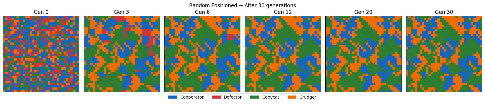
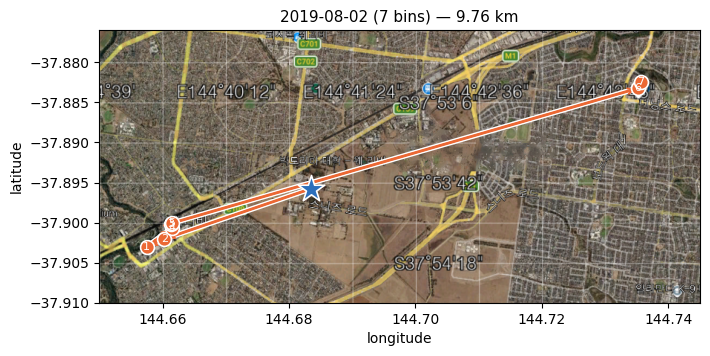
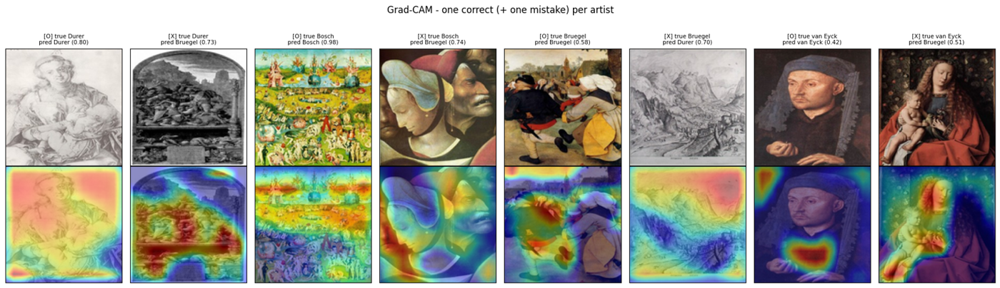
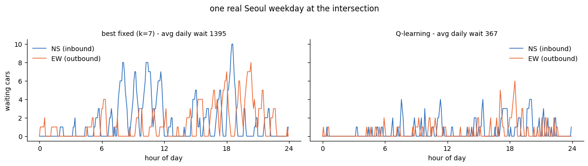

## What this is

A short course I teach for the SNU Center for Continuing Education, delivered at high schools as part of the 찾아가는 대학 programme. The Korean title is 눈으로 이해하는 인공신경망과 미분적분, roughly *understanding neural networks and calculus with your eyes*, which is the whole design brief in one phrase.

It has run at several schools since late 2025, most recently in 2026. Every run has the same shape. Three days of theory and hands-on notebooks, then the students propose what to build, and then I build what they proposed.

## The design problem

Students at this level have met derivatives. They have not met gradient descent, and they have certainly not met the idea that a derivative is a thing you can *use* rather than a thing you compute on an exam.

So the course never introduces a tool for its own sake. Every idea is introduced twice, once as the answer to a concrete question, and again later as a tool inside a bigger problem. The table I put at the front of the course notes is the actual spine.

| What we do | Concepts | Where it comes back |
|---|---|---|
| Gradient descent on cubics, quartics, quintics | derivative, learning rate, local minima | everywhere |
| MNIST and CIFAR-10 | MLP, convolution, CNN | applications I and II |
| Coins, $\pi$, random walks | law of large numbers, random processes | applications I and III |
| Evolution of trust, spatial evolution | strategy, reward, Q-learning | applications I and III |
| Urban heat island and green space | convolution, reward function, gradient ascent | the worked example |

A student who reaches the last day has seen convolution three times in three different costumes. That repetition is the point, and it is what makes the applications feel reachable rather than magical.

## Day 1, from derivatives to pixels

The first day starts with history and ends with a network that reads handwriting.

In between, the derivative is reintroduced as a direction rather than a number. The gradient $\nabla L$ points the way the loss climbs fastest, so the update

$$
\theta \leftarrow \theta - \eta \nabla L(\theta)
$$

walks downhill. We run gradient descent on polynomials of degree three, four and five, where the learning rate visibly matters and local minima are something you watch the ball fall into rather than something you are told about. Then backpropagation as the chain rule applied repeatedly, and a question I like, **where does a sigmoid actually feel the slope**, which makes saturation obvious before the term is ever used.

Then pixels are numbers, MNIST, and an MLP that works. The best moment of the day is a failure. The trained classifier is shown a digit the student draws themselves, in black on white rather than white on black, and it confidently gets it wrong. Inverting the brightness fixes it. Nobody forgets what a training distribution is after that.

## Day 2, randomness and convolution

Day 2 is probability and the move from MLP to CNN.

Coin flips give the law of large numbers, Monte Carlo gives $\pi$, and random walks give a process rather than a number. This is also where randomness inside AI gets named: initialization, shuffling, dropout, exploration.

Convolution arrives as the fix for what the MLP could not do, a filter that looks at neighbourhoods instead of at absolute pixel positions, and CIFAR-10 shows the difference on real images.

The Day 2 lab has its own longer write-up here, [[teaching/random-processes/index|random walks, greedy moves and Kawasaki dynamics]], which goes further than the class does into lattice dynamics.

## Day 3, learning from reward

The last day is game theory and reinforcement learning, and it is the students' favourite.

The iterated prisoner's dilemma comes first, then strategies with names, tit for tat, the generous variant, the grudger. Then the question that makes the day: what happens if the players sit on a grid and only play their neighbours?

Cooperation loses in a well-mixed population and survives on a lattice, because cooperators form blocks that protect their interior. Space rescues cooperation. From there, Q-learning is a small step, since the students have already accepted that a reward signal can shape behaviour without anyone specifying the behaviour.

## Then the students choose

At the end of Day 3 every student writes a proposal. Not a topic, a proposal, with a question, a data source and a guess at which tool applies.

Then I go away and build them, and the results come back as a written chapter with the mathematics spelled out. Three of these became the application half of the course notes.

### Application I, recycling

Classify waste from a small image set, predict when each smart bin fills, then route the collection truck.

This one uses nearly everything. A CNN on a deliberately small dataset, so data augmentation stops being a technicality and becomes the thing that makes it work at all. A fill-level model checked against real measurements rather than simulation alone. And Q-learning for the route, which is the Day 3 material pointed at a logistics problem.

### Application II, telling Renaissance masters apart

Classify paintings by artist on a tiny dataset, then use Grad-CAM to ask whether the network is looking at the right thing.

The honest result is the valuable one. The accuracy looked respectable, and the heat maps showed the model attending to canvas texture, frame edges and overall palette rather than to anything a person would call style. That is **shortcut learning**, discovered by the students rather than announced by me, and it is the single best argument for interpretability I have ever had in a classroom.

### Application III, traffic signals

A single intersection with Poisson arrivals, a reward that only counts waiting cars, and a Q-learning controller compared against the best possible fixed-cycle timing.

Fixed timing is not a straw man here, since the best fixed cycle length is found by sweeping it, which produces a U-shaped curve the students can reason about. The learned controller then beats it, and the interesting part is *where*, since the gap opens at rush hour, exactly when a fixed cycle cannot adapt. Run on a real weekday of Seoul traffic counts, average daily waiting drops from about 1395 to about 367.

## What I would tell another instructor

Three things have made the difference across runs.

**Let the failure happen first.** The inverted MNIST digit, the fixed signal at rush hour, the Grad-CAM heat map on the wrong region. Each is more instructive than the working version that follows, and none of them works if you warn the class in advance.

**Make the proposals real.** The promise that a proposal will actually be built changes what students write. They start asking where the data would come from, which is the part of research that is usually invisible to them.

**Keep the mathematics visible.** Every project comes back with its formulas written out, the reward function, the augmentation, the update rule. The course is called *understanding with your eyes*, but the eyes are supposed to land on an equation eventually.

## A note on materials

The course slides, notebooks and the summary textbook are the school's and mine. Student submissions are not published here and will not be, so the projects above are described by their content only.
