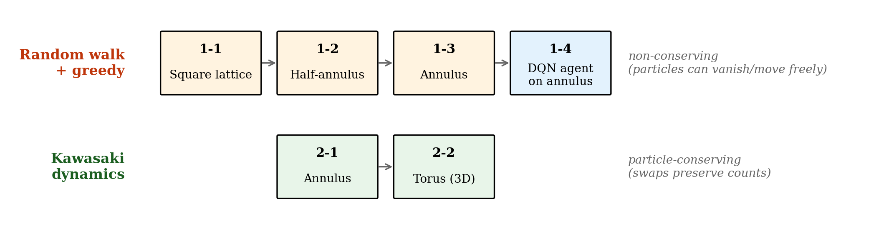
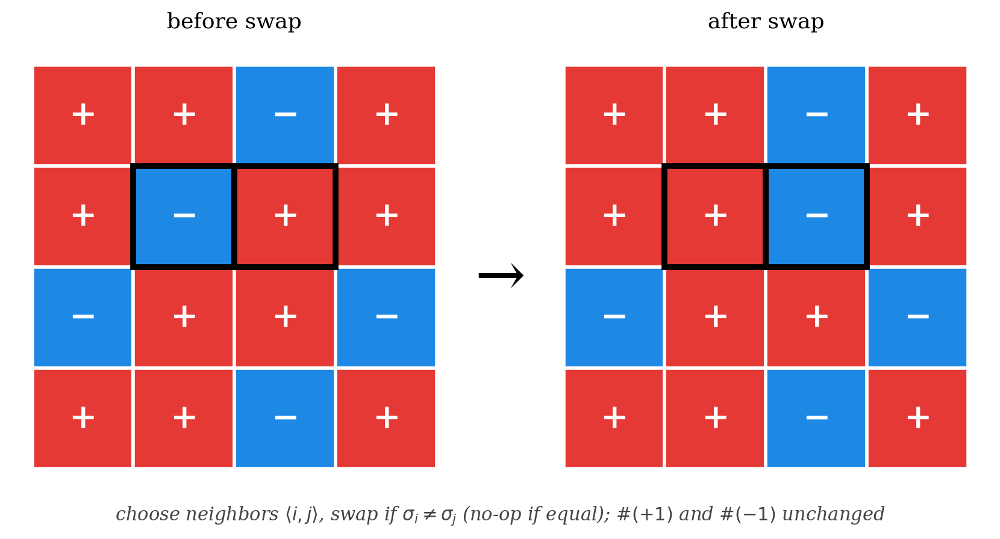

## What this post is

This is a teaching notebook I prepared for **Day 2** of an introductory series on randomness and dynamics on lattices. The audience was upper-level undergraduates with some Python experience but no prior exposure to Monte Carlo or reinforcement learning. The intent was to build, in one sitting, a working intuition for *how* random microscopic rules produce different macroscopic outcomes — from uniform diffusion all the way to particle-conserving exchange dynamics.

The notebook is included below for download, and a one-click Colab link is provided so anyone can re-run the simulations without local setup.

I have also revised the **Kawasaki section** of the notes to fix a small but real physics issue. Details in §3 below.

## Lecture flow

The notebook is structured in two halves:

Why this ordering? The first half (1-1 to 1-4) develops the *non-conserving* picture: each particle moves independently, the total number of particles is fixed but their identities can be anywhere. The second half (2-1 to 2-2) imposes a different conservation law — particle counts of two species are separately conserved, and the system can only relax via *exchange*. The contrast between these two regimes is the central pedagogical point.

## 1. Random walk and greedy on different spaces

The first half introduces three lattice geometries — square, half-annulus, full annulus — and on each runs the same two-phase scenario:

- **Phase 1 (Diffusion).** Each particle picks a random neighboring empty cell and moves there. No criterion for accepting or rejecting the move. After enough steps, the spatial distribution becomes approximately uniform.
- **Phase 2 (Greedy).** Same random move proposal, but the move is *only accepted if a score improves*. The score is "spacing": how far the particle is from its neighbors. Larger spacing = better.

The point of running these one after the other is: the two phases produce qualitatively different equilibria. Diffusion alone gives a uniform-looking blob. Greedy on top of that gives a *spaced* configuration — particles repel each other and settle into roughly equal spacing.

### Why the geometry matters

A square grid is convex. A half-annulus has a concave inner boundary. A full annulus has a hole — so it is **not simply connected**. Particles on the annulus can wind around the hole; particles on the square cannot.

This is the first place students see a topological invariant of the underlying space showing up in simulation behavior. It is also a setup that pays off later when we look at quantum walks on line graphs of these spaces — but that is a different post.

### 1-4: replacing the rule with a learned policy

The fourth subsection asks: *can an RL agent, given only sparse reward signals, discover the diffusion-then-greedy strategy on its own?*

Setup:
- **State**: a small patch of the lattice centered on the particle.
- **Actions**: up, down, left, right, stay (5 choices).
- **Reward**: positive if the particle's neighborhood spacing improves, negative if it worsens.
- **Algorithm**: standard DQN with experience replay and ε-greedy exploration.

After training, the agent is run with ε = 0 (pure greedy). The resulting configurations look qualitatively similar to the hand-coded greedy phase from 1-3.

The honest takeaway is *not* "DQN solves this problem better than the hand-coded rule." It does not. The takeaway is that the agent independently rediscovers a similar strategy — which is a good demonstration that the hand-coded rule was capturing something real about the reward landscape.

## 2. Kawasaki dynamics

The second half changes the model entirely. Now the lattice is *fully occupied* by two species — call them ±1 spins, drawn red and blue — and updates do not move a single particle into an empty space. Instead, **two neighboring sites swap their values**.

This is **Kawasaki dynamics**, named after Kyoji Kawasaki, who introduced it in the 1960s as a microscopic model with a *conservation law*: the number of +1 spins (and separately the number of −1 spins) is constant throughout the simulation. In the Hohenberg–Halperin classification of dynamical models near criticality, this is **Model B** — order-parameter-conserving dynamics.

## 3. Physics audit: cleaning up four subtle issues

When I went back through the notebook with a critical eye, I found four places where the physics narrative was either imprecise or — in one case — flat-out only correct in the regime we happened to be simulating. The notebook now has all four corrected. Here is what they were and what I changed.

### Issue 1: "uniform distribution" needs unpacking (§1-1)

The original notebook said something like *"random walk converges to a uniform equilibrium."* This is true for the simulations as run, but only for a subtle reason that I had glossed over.

A *single* random walker on a finite graph converges to its stationary distribution, which is **uniform only if the graph is regular**. On the square lattice with reflecting boundary, corner sites have degree 2 and interior sites have degree 4, so the single-walker stationary distribution is *not* uniform — it weights sites proportionally to their degree.

What we are simulating is different: a *symmetric simple exclusion process (SSEP)* — many particles with hard-core repulsion, each performing a random walk subject to the rule "no two particles can occupy the same cell." For SSEP, the equilibrium distribution is uniform over particle *configurations* — and this is what students see when the density profile flattens out. The notebook now flags this distinction explicitly so students don't carry away the wrong idea.

### Issue 2: topology of the annulus (§1-3)

The original notebook said *"the annulus is non-simply-connected, so particles can flow around the hole."* Mathematically true — the annulus has $\pi_1 \cong \mathbb{Z}$ — but easy to over-interpret.

The non-trivial topology shows up in **trajectory statistics** of individual walkers: the winding number around the hole, mean first-passage times between specific cells, etc. It does *not* show up in the **equilibrium density profile** for an exclusion process — at equilibrium the density is uniform on the available cells whether the space is simply connected or not.

So if a student looks at the simulation and asks "where is the topology?", the honest answer is "in the trajectories, not in this density visualization." The notebook now states that explicitly. The geometric difference between the half-annulus, full annulus, and square lattice is still visible in the *transient* relaxation, just not in the long-time density.

### Issue 3: the hydrodynamic limit is *not* always diffusion (§2)

This was the most interesting catch. The original notebook said:

> "거시적 농도장 $\rho(\vec x, t)$ 의 수준에서는 보존 확산방정식 $\partial_t \rho = D\Delta\rho$ 로 근사됩니다."

This is correct **only at $\beta = 0$**, the infinite-temperature limit we are simulating. At finite temperature, Kawasaki dynamics is **Hohenberg-Halperin Model B**, and the hydrodynamic limit is the *nonlinear* conserved equation

$$
\partial_t \rho \,=\, \nabla \cdot \bigl[M(\rho)\, \nabla \mu(\rho)\bigr],
$$

where $\mu(\rho)$ is a chemical potential and $M(\rho)$ a mobility, both nonlinear in $\rho$. Below the critical temperature, this equation produces **spinodal decomposition** and *coarsening* — domain growth with characteristic length scaling as $t^{1/3}$ (the Lifshitz-Slyozov-Wagner law). The system does *not* uniformly mix; instead, it organizes into ever-larger domains of one species.

So the statement *"Kawasaki at long times looks like diffusion"* is true at $\beta = 0$ (which is our simulation) but profoundly *false* at $T < T_c$. The revised notebook flags this explicitly so the finite-T exercise (#3 in the suggestions) lands in the right conceptual place — students should *expect* coarsening, not simple diffusive smoothing.

### Issue 4: 3D torus visualization distortion (§2-2.3)

The 3D torus animation shows the lattice mapped to the standard torus surface in $\mathbb{R}^3$:

$$
X = (R + r\cos v)\cos u,\quad Y = (R + r\cos v)\sin u,\quad Z = r \sin v.
$$

The simulation runs on the **flat** 2D torus (which is just $\mathbb{R}^2 / N\mathbb{Z}^2$ with the Euclidean metric). When you embed it in $\mathbb{R}^3$ using the equation above, the surface area is *not* uniform — outer regions ($\cos v > 0$) have more area per unit $(u, v)$ than inner regions ($\cos v < 0$). So the same lattice density appears *visually* sparser on the outside and denser on the inside.

This is a pure visualization artifact — the simulation itself is on the flat torus and is correct. The notebook now mentions this so students don't infer dynamics from what is really a curvature effect of the embedding.

### A small unifying note

While we're here, the original notebook had random-walk + greedy in §1 and Kawasaki at $T = \infty$ in §2 as if they were separate stories. They aren't — the natural physics analogy is

$$
\underbrace{\text{Random walk + greedy}}_{T = \infty\,\to\,T = 0} \quad\longleftrightarrow\quad \underbrace{\text{Kawasaki at }T = \infty\text{ vs. }T < T_c}_{\text{disordered}\,\to\,\text{ordered}}
$$

The revised intro to §1 now points this out. It's a one-line edit but it gives the lecture a unifying frame: in both halves, the contrast between *high-temperature* (uniform mixing) and *low-temperature* (structure formation) is the question we're asking.

## Run it yourself

The full notebook is included below. You can either:

**Open in Google Colab** (no local setup, runs on free Colab CPU):

The badge above links directly to this exact notebook on GitHub via Colab's import endpoint. As long as the post is published to the live site (so the `.ipynb` is in the repo at the path above), the link works without further setup.

**Download the `.ipynb`** for local Jupyter use. It depends only on `numpy`, `matplotlib`, `IPython`, and `tqdm`. The DQN cell (1-4) additionally uses `torch`, but it is optional — the rest of the notebook runs without it.

Approximate run times on a free Colab CPU runtime:

| Section | Time |
|---|---|
| 1-1, 1-2, 1-3 (random walk + greedy) | ~ 1 min each |
| 1-4 (DQN training) | ~ 5–10 min |
| 2-1, 2-2 (Kawasaki on annulus + torus) | ~ 2 min each |
| 2-2.3, 2-2.4 (3D torus visualizations) | ~ 3 min each |

Total: under 20 minutes if you skip the DQN cell, around 30 minutes including it.

## What I would do differently next time

Three notes for myself if I teach this lecture again:

- **Move the Kawasaki section earlier.** The conservation-law contrast is the most surprising thing in the notebook, and currently it lands at the end after 1.5 hours of build-up. Half an hour of random walk + greedy is enough.
- **Drop the DQN cell, or split it off.** It is a fun demonstration but adds a lot of conceptual surface area (replay buffers, target networks, ε-decay) that distracts from the dynamics theme. A separate "Day 2.5" notebook on RL would be cleaner.
- **Add a coarsening exercise.** Finite-temperature Kawasaki at low $T$ produces visually striking domain growth that is not in the current notebook. The exercise hint at the end of §3 above is the place to start.

## References

1. K. Kawasaki, *Diffusion constants near the critical point for time-dependent Ising models I*, Phys. Rev. 145 (1966), 224.
2. P. C. Hohenberg and B. I. Halperin, *Theory of dynamic critical phenomena*, Rev. Mod. Phys. 49 (1977), 435 — the standard reference for Model A (Glauber, non-conserving) vs. Model B (Kawasaki, conserving).
3. M. E. J. Newman and G. T. Barkema, *Monte Carlo Methods in Statistical Physics*, Oxford University Press (1999), Chapter 5 — for Metropolis vs. heat-bath comparison.
4. R. S. Sutton and A. G. Barto, *Reinforcement Learning: An Introduction*, MIT Press (2nd ed., 2018) — for DQN and ε-greedy.
